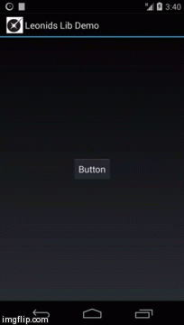

AndroidX Particles
==========================
[](https://github.com/thomorl/androidx-particles/releases)
[](LICENSE)

This library is a fork of [Leonids](https://github.com/plattysoft/Leonids), a lightweight particle system library that works with the standard Android UI.

You can download the [Leonids Demo from Google Play](https://play.google.com/store/apps/details?id=com.plattysoft.leonids.examples) to check out what can be done with it.

## Setup

AndroidX Particles is available from JCenter.

### Android Studio / Gradle

Add the following dependency to your project's build file:
```gradle
dependencies {
    implementation 'androidx.particles:particles:1.3.3'
}
```
**Note**: If you get an error, you may need to include the JCenter repository:
```gradle
repositories {
    jcenter()
}
```

## Why this library?

Particle systems are often used in games for a wide range of purposes: Explosions, fire, smoke, …  
These effects can also be used in non-game apps to add an element of "juiciness" or playful design.

Precisely because its main use is games, all engines have support for particle systems, but there is no such thing available for the standard Android UI.

This means that if you are building an Android app and want a particle system, you have to include a graphics engine and use OpenGL—which is quite the overkill—or you have to implement it yourself.

AndroidX Particles is made to fill this gap, bringing particle systems to developers that use the standard Android UI.

## Basic Usage

Creating and firing a one-shot particle system is very easy, requiring just 3 lines of code.

```java
new ParticleSystem(this, numParticles, drawableResId, timeToLive)
        .setSpeedRange(0.2f, 0.5f)
        .oneShot(anchorView, numParticles);
```

Note that the particle system checks the position of the anchor view when `oneShot()` or `emit()` is called, so it requires the views to be measured. This means that **the particle system won't work properly if you call `oneShot()` or `emit()` during onCreate or onStart**. For more information, check the [FAQ](https://github.com/thomorl/androidx-particles/wiki/FAQ#my-particles-are-always-shown-in-the-top-left-corner-what-is-going-on).

When you create the particle system, you specify how many particles it will use at maximum, the resource ID or the drawable you want to use for the particles, and how long the particles will live.

Then you configure the particle system. In this case, we specify that the particles will have a speed between `0.2` and `0.5` pixels per millisecond (support for _dp_ will be included in the future). Since we did not provide an angle range, it will be considered as "any angle" (0° – 360°).

Finally, we call `oneShot()`, passing the view from which the particles will be launched and specifying how many particles we want to shoot.



## Emitters

You can configure emitters, which have a constant ratio of particles being emitted per second.
This is the code for the confetti example:

```java
new ParticleSystem(this, 80, R.drawable.confeti2, 10000)
        .setSpeedModuleAndAngleRange(0f, 0.3f, 180, 180)
        .setRotationSpeed(144)
        .setAcceleration(0.00005f, 90)
        .emit(findViewById(R.id.emiter_top_right), 8);

new ParticleSystem(this, 80, R.drawable.confeti3, 10000)
        .setSpeedModuleAndAngleRange(0f, 0.3f, 0, 0)
        .setRotationSpeed(144)
        .setAcceleration(0.00005f, 90)
        .emit(findViewById(R.id.emiter_top_left), 8);
```

It uses an initializer for the speed as module and angle ranges, a fixed speed rotation and external acceleration.


## Documentation

Use the [Cheat Sheet](https://github.com/thomorl/androidx-particles/wiki/Cheat-Sheet) or [FAQ](https://github.com/thomorl/androidx-particles/wiki/FAQ) pages in the [Wiki](https://github.com/thomorl/androidx-particles/wiki) to get a quick overview.

For a more detailed documentation, see the [Reference](https://thomorl.github.io/androidx-particles/reference/1.3/).

## Other Details

AndroidX Particles requires minSDK 14 / Android 4.0 (Ice Cream Sandwich).

The library is open-source software; you can use it, extended with no requirement to open-source your changes. You can also make paid apps using it.

## Acknowledgements

Leonids was created by Raul Portales ([@plattysoft](https://github.com/plattysoft)).
